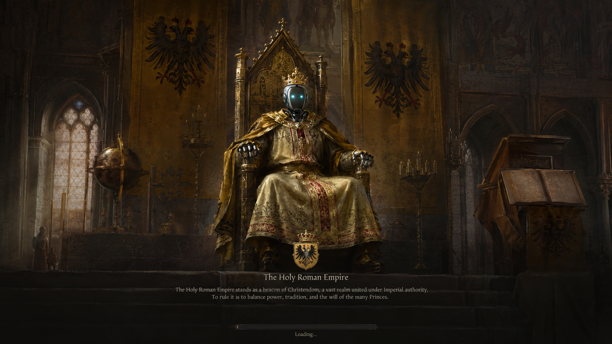

# AGI CK3



An evaluation harness for AI agents playing Crusader Kings III through
legal, game-guarded actions.

Bring your own agent: any agent that can run a CLI plays by driving the
observe/step loop itself — its model, memory, and harness design are all
part of what is evaluated. **[AGENTS.md](AGENTS.md) is the play
protocol.** A game-side mod re-checks CK3's own availability rules
before executing anything; the harness referees budgets, records the
full trajectory (actions, rationales, conduct), and produces a proof
bundle that can be re-scored without the game installed. The long-term
benchmark goal:

> Start as a landless adventurer and legally work toward control or
> restoration of the Holy Roman Empire through normal CK3 mechanics.

The harness never grants titles, gold, claims, or other shortcuts, and an
evaluated agent never receives raw console authority. What the game's
rules forbid, the agent cannot do; what they allow, the agent must find.

## Status

Action families certify individually against the live game before they
may execute in evaluated runs:

| Family | Status |
| --- | --- |
| telemetry refresh, checkpoint, wait, decisions, camp movement | live-proven |
| gifts | probe-proven; execution pending a qualifying state |
| event options | live-proven across standard, chain, and letter window classes; identity read from checkpoints |
| wars, marriage, education, alliances, contracts, lifestyle | implemented, awaiting live certification |

A 100-step unattended baseline run completes with zero human
interventions at ~310 ms median step latency; interrupting events resolve
through the option selector in 150-500 ms with identity extracted from
checkpoint saves (`scripts/mac-year.sh` runs a full survival-year episode
unattended). The first agent-driven reference episode — Claude Code
playing through [AGENTS.md](AGENTS.md) verbatim — survived its first year
as a landless adventurer; its auditable bundle is in
[`submissions/`](submissions/).

Platforms: the full live loop is proven on macOS desktop (the staged
console verbs use an AppleScript keystroke shim). On Linux, headless
game boot is verified (virtual display, software Vulkan, no Steam client
or launcher) and the input-injection path is specified but not yet wired
into the transport — see `infra/linux/RUNBOOK.md` for the recipe and its
acceptance gates. Windows is unsupported until someone contributes a
keystroke shim.

## Quick start

Requirements: Python 3.11+, and CK3 via Steam for live runs.

```bash
git clone https://github.com/Kleptobyte/AGI-CK3.git
cd AGI-CK3
make test                      # offline suite, no game required
python -m ck3env doctor        # environment diagnosis
```

Live runs (macOS today; Linux pending the input port — see Platforms):

1. Register the mod and generate the per-version GUI overrides —
   `doctor` prints every command with concrete paths (`next_steps`):
   `python -m ck3env install-mod ...`, `install-runner ...`,
   `install-event-gui ...`, then enable the mod in a launcher playset.
2. Launch CK3 with `-debug_mode -develop` and a campaign loaded and
   paused.
3. Drive an episode (full protocol in [AGENTS.md](AGENTS.md)):

```bash
python -m ck3env reset --run runs/demo --task smoke --seed 1 --live --ck3-user-dir "<CK3 documents dir>" \
  --agent-name "my-agent" --agent-model "model-id"
python -m ck3env observe --run runs/demo --live --ck3-user-dir "<CK3 documents dir>"
python -m ck3env step  --run runs/demo --live --ck3-user-dir "<CK3 documents dir>" <affordance_id> <observation_id> --rationale "why"
python -m ck3env finalize --run runs/demo --live --ck3-user-dir "<CK3 documents dir>"
python -m ck3env rescore runs/demo/bundle.zip
```

`baseline-run` drives the scripted baseline policy for unattended soak
runs — the leaderboard floor any evaluated agent should beat. The
Makefile is developer convenience only; the CLI and library are the
interface.

## Documentation

- [Architecture](docs/architecture.md) — transport, observation, action
  surface, scoring, reproducibility.
- [Roadmap](docs/roadmap.md) — project target and release gates.
- [Prior art](docs/prior-art-and-novelty.md) — where this sits among game
  benchmarks.
- [Linux runtime](infra/linux/RUNBOOK.md) — portable headless recipe.

## Not included

CK3 itself, saves, logs, credentials, or any Paradox-owned content.
Operators download the game with their own license; proof bundles let
third parties audit and re-score runs without owning it.

## License and affiliation

MIT (see [LICENSE](LICENSE)). AGI CK3 is an independent project, not
affiliated with or endorsed by Paradox Interactive. Crusader Kings III
belongs to Paradox Interactive.
